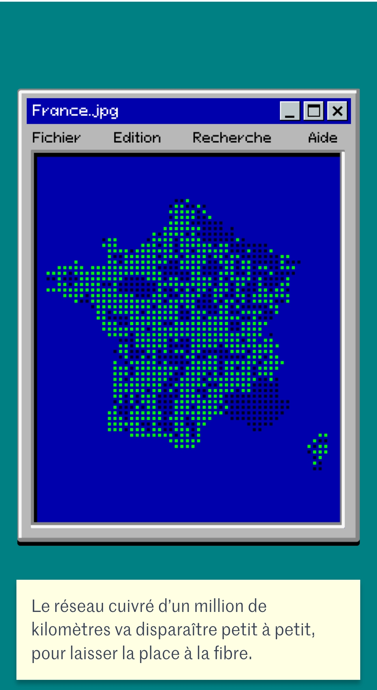
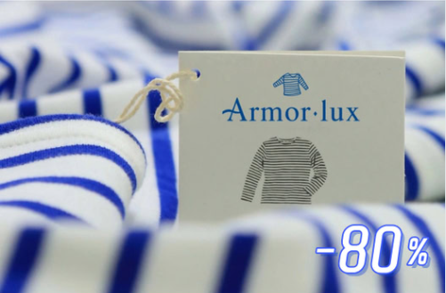
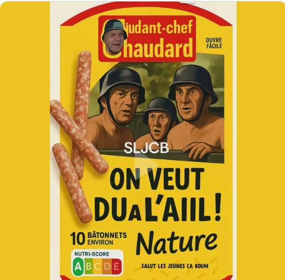

# Bbrod's French Theme Pack

Une collection de thèmes VSCode uniques inspirés d'images françaises emblématiques, humoristiques ou classiques.

## Thèmes Inclus (v1.2.0)

Ce pack contient actuellement 5 thèmes :

---

### 1. Win95 FranceJPG Retro

*   **Type :** Sombre (`vs-dark`)
*   **Inspiration :** L'esthétique Windows 95 et l'image `France.jpg`. Un voyage nostalgique dans l'informatique des années 90.
*   **Aperçu / Inspiration :**
    

---

### 2. Armor-lux Marinière

*   **Type :** Clair (`vs`)
*   **Inspiration :** Les couleurs iconiques bleu et blanc de la marque bretonne Armor-lux. Pour une ambiance marine et classique.
*   **Aperçu / Inspiration :**
    

---

### 3. Chaudard - Ail Edition

*   **Type :** Clair (`vs`)
*   **Inspiration :** Le packaging parodique jaune et rouge "On veut du à l'ail !" avec l'Adjudant-Chef Chaudard. Pour coder avec humour !
*   **Aperçu / Inspiration :**
    

---

### 4. Pascale Resurrection

*   **Type :** Sombre (`vs-dark`)
*   **Inspiration :** Le contraste entre l'obscurité de la grotte et la lumière dorée de la résurrection Pascale.
*   **Aperçu / Inspiration :**
    

---

### 5. Citroën Chevrons

*   **Type :** Sombre (`vs-dark`)
*   **Inspiration :** Les couleurs bleu marine profond, jaune vif et blanc du logo classique de Citroën.
*   **Aperçu / Inspiration :**
    

---

## Installation

### Méthode 1 : Test Local (Développement)

1.  Clonez ce dépôt : `git clone https://github.com/valorisa/Win95-Francejpg-Retro-Theme.git` (Adaptez l'URL si vous renommez le dépôt).
2.  Ouvrez le dossier cloné dans VS Code (`Fichier > Ouvrir un dossier...`).
3.  Allez dans la vue "Exécuter et déboguer" (icône insecte/play).
4.  Appuyez sur `F5` (ou cliquez sur le bouton vert "Play" à côté de "Run Extension").
5.  Une nouvelle fenêtre VS Code "[Hôte de développement d'extension]" s'ouvrira. C'est **dans cette fenêtre** que les thèmes seront disponibles pour le test.

### Méthode 2 : Installation Manuelle

1.  Copiez l'intégralité de ce dossier projet.
2.  Collez-le dans votre dossier d'extensions VS Code :
    *   **Windows :** `%USERPROFILE%\.vscode\extensions`
    *   **macOS :** `~/.vscode/extensions`
    *   **Linux :** `~/.vscode/extensions`
3.  Redémarrez VS Code.

## Activation

1.  Ouvrez la Palette de commandes (Ctrl+Maj+P ou Cmd+Maj+P).
2.  Tapez `Préférences : Thème de couleurs` (ou `Preferences: Color Theme`).
3.  Sélectionnez l'un des thèmes du pack dans la liste :
    *   `Win95 FranceJPG Retro`
    *   `Armor-lux Marinière`
    *   `Chaudard - Ail Edition`
    *   `Pascale Resurrection`
    *   `Citroën Chevrons`

Profitez de ces ambiances uniques pour coder !
